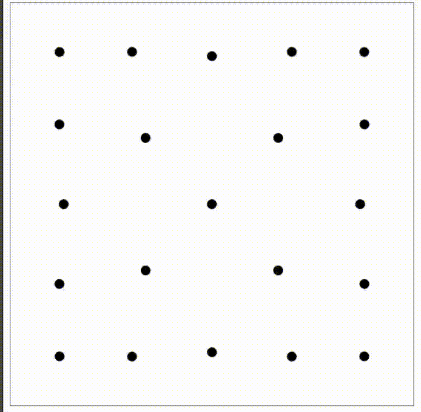

# OCDots

> OCDots is a javascript library for creating evenly distributed points inside a polygon

[](https://codecov.io/gh/luxedo/ocdots) [](https://www.codefactor.io/repository/github/luxedo/ocdots) [](https://badge.fury.io/js/ocdots) [](https://www.gnu.org/licenses/gpl-3.0)



#### Check the [demo](https://luxedo.github.io/OCDots/)!

## Quick Start

OCDots uses physics to maximize the distance between each point and
also the distance to the walls of a polygon. It is possible to follow
each step of the process calling `movePoints`, or call `relaxPoints`
to run several iterations and see the final state.

Import the library, then call `movePoints` on a set of points to run
one iteration

```javascript
const polygon = [
  [0, 0],
  [0, 500],
  [500, 500],
  [500, 0],
  [0, 0],
];
const points = [
  [10, 10],
  [20, 20],
  [30, 30],
  [40, 40],
  [50, 50],
  [60, 60],
  [70, 70],
  [80, 80],
  [90, 91],
];
let momentum = points.map(() => [0, 0]);
const newPoints = ocdots.movePoints({
  points,
  momentum,
  polygon,
}); // Points closer to the relaxed position
// newPoints:
// [[13.535794548720887, 13.535273243928348],
// [23.27147728369301, 23.266677836465515],
// [31.254830565917008, 31.24699231498995],
// [41.28615235332842, 41.272681142242014],
// [51.958871850605114, 51.93302052874113],
// [63.120940102952105, 63.061513386276076],
// [73.60106973613009, 73.4687601178992],
// [83.7612857566466, 83.29434810802492],
// [93.40654447613721, 94.65998015460454]]
```

Or call `relaxPoints` to run several iterations:

```javascript
const polygon = [
  [0, 0],
  [0, 500],
  [500, 500],
  [500, 0],
  [0, 0],
];
const points = [
  [10, 10],
  [20, 20],
  [30, 30],
  [40, 40],
  [50, 50],
  [60, 60],
  [70, 70],
];
const iterations = 600;
const newPoints = ocdots.relaxPoints({
  points,
  polygon,
  iterations,
}); // Points closer to the relaxed position, 600 iterations
// newPoints:
// [[102.97786539754973, 102.93913654344668],
// [249.88751973067804, 95.97842402445758],
// [95.85157380539883, 249.581118685883],
// [249.83589254388568, 250.64858636270534],
// [103.38882973892018, 396.3498058144843],
// [396.8795797129724, 103.0543405820668],
// [249.77618266302204, 404.4383179086723],
// [404.0862954198404, 249.7401659115181],
// [396.995879400969, 396.84327821075937]]
```

## Install

Install with npm:

```bash
npm install ocdots
```

To use with node just import the module:

```javascript
const ocdots = require("ocdots");
ocdots.movePoints(...);
```

In the browser import the script as a [module](https://developer.mozilla.org/en-US/docs/Web/JavaScript/Guide/Modules):

```html
<script type="module">
  import * as ocdots from './node_modules/ocdots/dist.browser/ocdots.js';
  ocdots.movePoints(...);
</script>
```

You can also [download ocdots.js](https://raw.githubusercontent.com/luxedo/OCDots/master/docs/ocdots.js)
and alongside with [simplify.js](https://raw.githubusercontent.com/luxedo/OCDots/master/docs/simplify.js)
and import as you prefer.

## Usage

`ocdots` provides several functions to iterate a set of `points` in a
`polygon`. All functions must be called with
[named parameters](https://exploringjs.com/impatient-js/ch_callables.html#named-parameters)

<a name="movePoints"></a>

## movePoints(config) ⇒ <code>Array.&lt;Array&gt;</code>

Moves points according to the applied forces into it. The forces
are: 1) between points, 2) between the point and walls of the
polygon.

The points moves according to it's momentum up to maxMomentum.
Drag reduces the momentum with the square of the momentum.
Viscosity lowers the momentum of points with high forces.

Runs one iteration

**Kind**: global function  
**Returns**: <code>Array.&lt;Array&gt;</code> - points, momentum - Updated points and momentum
arrays

| Param                    | Type                                                     | Description                                                                                                                                                                        |
| ------------------------ | -------------------------------------------------------- | ---------------------------------------------------------------------------------------------------------------------------------------------------------------------------------- |
| config                   | <code>Object</code>                                      | configuration object                                                                                                                                                               |
| congig.points            | <code>Array</code>                                       | The points to move                                                                                                                                                                 |
| config.momentum          | <code>Array</code>                                       | Accumulated momentum for each point. [0, 0] when the points are stopped.                                                                                                           |
| config.polygon           | <code>Array</code>                                       | Set of points that describes the polygon that contains the points. This polygon should be ordered (clockwise or anticlockwise) and closed i.e. first points equals the last point. |
| config.mass              | <code>Array.&lt;Number&gt;</code> \| <code>Number</code> | Mass or masses of the points.                                                                                                                                                      |
| config.charge            | <code>Array.&lt;Number&gt;</code> \| <code>Number</code> | Charge or charges of the points.                                                                                                                                                   |
| [config.baseForce]       | <code>Number</code>                                      | The force constant                                                                                                                                                                 |
| [config.drag]            | <code>Number</code>                                      | The drag coeficient                                                                                                                                                                |
| [config.viscosity]       | <code>Number</code>                                      | The viscosity coeficient                                                                                                                                                           |
| [config.maxMomentum]     | <code>Number</code>                                      | Maximum momentum for each point                                                                                                                                                    |
| [config.parallelForces]  | <code>Boolean</code>                                     | Sum line segmen parallel forces as well.                                                                                                                                           |
| [config.wallForces]      | <code>Number</code>                                      | Walls forces constant                                                                                                                                                              |
| [config.simplifyPolygon] | <code>Number</code>                                      | Simplify polygon tolerance (0 disabled)                                                                                                                                            |

<a name="randomInPolygon"></a>

## randomInPolygon(N, polygon) ⇒ <code>Array</code>

Creates N points inside the polygon

**Kind**: global function  
**Returns**: <code>Array</code> - points N points inside the polygon

| Param   | Type                | Description                                                                                                                                               |
| ------- | ------------------- | --------------------------------------------------------------------------------------------------------------------------------------------------------- |
| N       | <code>Number</code> | Number of points                                                                                                                                          |
| polygon | <code>Array</code>  | Set of points that describes the polygon. This polygon should be ordered (clockwise or anticlockwise) and closed i.e. first points equals the last point. |

<a name="randomInGeoPolygon"></a>

## randomInGeoPolygon(N, geoPolygon) ⇒ <code>Array</code>

Creates N points inside a geo polygon,

**Kind**: global function  
**Returns**: <code>Array</code> - points N points inside the geo polygon

| Param      | Type                | Description                           |
| ---------- | ------------------- | ------------------------------------- |
| N          | <code>Number</code> | Number of points                      |
| geoPolygon | <code>Array</code>  | Polygon of geo coordinates {lat, lng} |

<a name="relaxPoints"></a>

## relaxPoints(config) ⇒ <code>Array</code>

Runs several iterations of movePoints(). The drag increases in every
iteration attenuating the movement.

**Kind**: global function  
**Returns**: <code>Array</code> - points Last iteration points positions

| Param                    | Type                                                     | Description                                                                                                                                                                        |
| ------------------------ | -------------------------------------------------------- | ---------------------------------------------------------------------------------------------------------------------------------------------------------------------------------- |
| config                   | <code>Object</code>                                      | configuration object                                                                                                                                                               |
| config.points            | <code>Array</code>                                       | The points to move                                                                                                                                                                 |
| config.momentum          | <code>Array</code>                                       | Initial momentum. [0, 0] for all points if ommited                                                                                                                                 |
| config.polygon           | <code>Array</code>                                       | Set of points that describes the polygon that contains the points. This polygon should be ordered (clockwise or anticlockwise) and closed i.e. first points equals the last point. |
| config.iterations        | <code>Number</code>                                      | Number of iterations to run                                                                                                                                                        |
| [config.callback]        | <code>function</code>                                    | Callback function to run at every iteration (optional). Callback args: points, momentum, polygon, baseForce, currentDrag, viscosity, maxMomentum                                   |
| config.mass              | <code>Array.&lt;Number&gt;</code> \| <code>Number</code> | Mass or masses of the points.                                                                                                                                                      |
| config.charge            | <code>Array.&lt;Number&gt;</code> \| <code>Number</code> | Charge or charges of the points.                                                                                                                                                   |
| [config.baseForce]       | <code>Number</code>                                      | The force constant                                                                                                                                                                 |
| [config.drag]            | <code>Number</code>                                      | The drag coeficient                                                                                                                                                                |
| [config.viscosity]       | <code>Number</code>                                      | The viscosity coeficient                                                                                                                                                           |
| [config.maxMomentum]     | <code>Number</code>                                      | Maximum momentum for each point                                                                                                                                                    |
| [config.parallelForces]  | <code>Boolean</code>                                     | Sum line segmen parallel forces as well.                                                                                                                                           |
| [config.wallForces]      | <code>Number</code>                                      | Walls forces constant                                                                                                                                                              |
| [config.simplifyPolygon] | <code>Number</code>                                      | Simplify polygon tolerance (0 disabled)                                                                                                                                            |
| [config.attenuation]     | <code>Number</code>                                      | Rate of attenuation                                                                                                                                                                |

<a name="relaxNPoints"></a>

## relaxNPoints(config) ⇒ <code>Array</code>

Calls relaxPoints for N random points placed inside the polygon.

**Kind**: global function  
**Returns**: <code>Array</code> - points Last iteration points positions

| Param                    | Type                                                     | Description                                                                                                                                                                        |
| ------------------------ | -------------------------------------------------------- | ---------------------------------------------------------------------------------------------------------------------------------------------------------------------------------- |
| config                   | <code>Object</code>                                      | configuration object                                                                                                                                                               |
| config.N                 | <code>Number</code>                                      | Number of points                                                                                                                                                                   |
| config.polygon           | <code>Array</code>                                       | Set of points that describes the polygon that contains the points. This polygon should be ordered (clockwise or anticlockwise) and closed i.e. first points equals the last point. |
| config.iterations        | <code>Number</code>                                      | Number of iterations to run                                                                                                                                                        |
| [config.callback]        | <code>function</code>                                    | Callback function to run at every iteration (optional). Callback args: points, momentum, polygon, baseForce, currentDrag, viscosity, maxMomentum                                   |
| config.mass              | <code>Array.&lt;Number&gt;</code> \| <code>Number</code> | Mass or masses of the points.                                                                                                                                                      |
| config.charge            | <code>Array.&lt;Number&gt;</code> \| <code>Number</code> | Charge or charges of the points.                                                                                                                                                   |
| [config.baseForce]       | <code>Number</code>                                      | The force constant                                                                                                                                                                 |
| [config.drag]            | <code>Number</code>                                      | The drag coeficient                                                                                                                                                                |
| [config.viscosity]       | <code>Number</code>                                      | The viscosity coeficient                                                                                                                                                           |
| [config.maxMomentum]     | <code>Number</code>                                      | Maximum momentum for each point                                                                                                                                                    |
| [config.parallelForces]  | <code>Boolean</code>                                     | Sum line segmen parallel forces as well.                                                                                                                                           |
| [config.wallForces]      | <code>Number</code>                                      | Walls forces constant                                                                                                                                                              |
| [config.simplifyPolygon] | <code>Number</code>                                      | Simplify polygon tolerance (0 disabled)                                                                                                                                            |
| [config.attenuation]     | <code>Number</code>                                      | Rate of attenuation                                                                                                                                                                |

<a name="relaxGeoPoints"></a>

## relaxGeoPoints(config) ⇒ <code>Object</code>

Converts geoPoints and geoPolygon to a points and polygon, then
calls relaxPoints, returning the last position of the points.

**Kind**: global function  
**Returns**: <code>Object</code> - { polygon, points, geoPoints } Last iteration geo
points positions

| Param                    | Type                                                     | Description                                                                                                                           |
| ------------------------ | -------------------------------------------------------- | ------------------------------------------------------------------------------------------------------------------------------------- |
| config                   | <code>Object</code>                                      | configuration object                                                                                                                  |
| config.geoPoints         | <code>Array</code>                                       | Points in geo coordinates {lat, lng}                                                                                                  |
| config.geoPolygon        | <code>Array</code>                                       | Polygon of geo coordinates {lat, lng}                                                                                                 |
| config.width             | <code>Number</code>                                      | Width of the polygon                                                                                                                  |
| config.iterations        | <code>Number</code>                                      | Number of iterations to run                                                                                                           |
| [confi.callback]         | <code>function</code>                                    | Callback function to run at every iteration. Callback args: points, momentum, polygon, baseForce, currentDrag, viscosity, maxMomentum |
| config.mass              | <code>Array.&lt;Number&gt;</code> \| <code>Number</code> | Mass or masses of the points.                                                                                                         |
| config.charge            | <code>Array.&lt;Number&gt;</code> \| <code>Number</code> | Charge or charges of the points.                                                                                                      |
| [config.baseForce]       | <code>Number</code>                                      | The force constant                                                                                                                    |
| [config.drag]            | <code>Number</code>                                      | The drag coeficient                                                                                                                   |
| [config.viscosity]       | <code>Number</code>                                      | The viscosity coeficient                                                                                                              |
| [config.maxMomentum]     | <code>Number</code>                                      | Maximum momentum for each point                                                                                                       |
| [config.parallelForces]  | <code>Boolean</code>                                     | Sum line segmen parallel forces as well.                                                                                              |
| [config.wallForces]      | <code>Number</code>                                      | Walls forces constant                                                                                                                 |
| [config.simplifyPolygon] | <code>Number</code>                                      | Simplify polygon tolerance (0 disabled)                                                                                               |
| [config.attenuation]     | <code>Number</code>                                      | Rate of attenuation                                                                                                                   |

<a name="relaxNGeoPoints"></a>

## relaxNGeoPoints(config) ⇒ <code>Object</code>

Calls relaxGeoPoints for N random points placed inside the polygon.

**Kind**: global function  
**Returns**: <code>Object</code> - { polygon, points, geoPoints } Last iteration geo
points positions

| Param                    | Type                                                     | Description                                                                                                                           |
| ------------------------ | -------------------------------------------------------- | ------------------------------------------------------------------------------------------------------------------------------------- |
| config                   | <code>Object</code>                                      | configuration object                                                                                                                  |
| config.N                 | <code>Number</code>                                      | Number of points                                                                                                                      |
| config.geoPolygon        | <code>Array</code>                                       | Polygon of geo coordinates {lat, lng}                                                                                                 |
| config.width             | <code>Number</code>                                      | Width of the polygon                                                                                                                  |
| config.iterations        | <code>Number</code>                                      | jNumber of iterations to run                                                                                                          |
| [config.callback]        | <code>function</code>                                    | Callback function to run at every iteration. Callback args: points, momentum, polygon, baseForce, currentDrag, viscosity, maxMomentum |
| config.mass              | <code>Array.&lt;Number&gt;</code> \| <code>Number</code> | Mass or masses of the points.                                                                                                         |
| config.charge            | <code>Array.&lt;Number&gt;</code> \| <code>Number</code> | Charge or charges of the points.                                                                                                      |
| [config.baseForce]       | <code>Number</code>                                      | The force constant                                                                                                                    |
| [config.drag]            | <code>Number</code>                                      | The drag coeficient                                                                                                                   |
| [config.viscosity]       | <code>Number</code>                                      | The viscosity coeficient                                                                                                              |
| [config.maxMomentum]     | <code>Number</code>                                      | Maximum momentum for each point                                                                                                       |
| [config.parallelForces]  | <code>Boolean</code>                                     | Sum line segmen parallel forces as well.                                                                                              |
| [config.wallForces]      | <code>Number</code>                                      | Walls forces constant                                                                                                                 |
| [config.simplifyPolygon] | <code>Number</code>                                      | Simplify polygon tolerance (0 disabled)                                                                                               |
| [config.attenuation]     | <code>Number</code>                                      | Rate of attenuation                                                                                                                   |

<a name="buildPolygon"></a>

## buildPolygon(geoPolygon, width) ⇒ <code>Object</code>

Transforms a set of coordinates into a polygon with a known width

**Kind**: global function  
**Returns**: <code>Object</code> - { polygon, minLat, minLng, delta }

| Param      | Type                | Description                           |
| ---------- | ------------------- | ------------------------------------- |
| geoPolygon | <code>Array</code>  | Polygon of geo coordinates {lat, lng} |
| width      | <code>Number</code> | Width of the polygon                  |

## License

> OCDots
> Copyright (C) 2020 Luiz Eduardo Amaral <luizamaral306@gmail.com>
>
> This program is free software: you can redistribute it and/or modify
> it under the terms of the GNU General Public License as published by
> the Free Software Foundation, either version 3 of the License, or
> (at your option) any later version.
>
> This program is distributed in the hope that it will be useful,
> but WITHOUT ANY WARRANTY; without even the implied warranty of
> MERCHANTABILITY or FITNESS FOR A PARTICULAR PURPOSE. See the
> GNU General Public License for more details.
>
> You should have received a copy of the GNU General Public License
